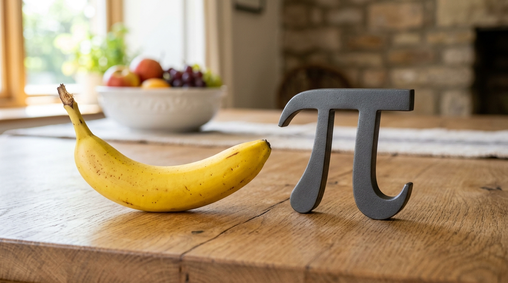

# Nano Banana



Image generation for [pi-coding-agent](https://github.com/badlogic/pi-mono) using Google Gemini AI.

Generate images, icons, patterns, diagrams, stories, and more.

## Install

```bash
pi install https://github.com/yagaltd/pi-nanobanana
```

## Use It

Just describe what you want:

```
Generate a sunset over mountains
Create 4 logo variations
Make a flowchart
Design an app icon
```

## Commands

| Command | What it does |
|---------|--------------|
| `/generate` | Create images with styles |
| `/icon` | App icons, favicons |
| `/pattern` | Seamless patterns |
| `/diagram` | Flowcharts, architecture |
| `/story` | Multi-panel sequences |
| `/edit` | Edit existing images |
| `/restore` | Enhance/restore images |

## Options

```
/generate A logo --count 4 --styles modern,minimal
/icon Rocket --type app-icon --sizes 32,64,128
/diagram Architecture --complexity detailed
```

## Output

Images save to `.pi/generated-images/` in your current project.

## License

MIT
